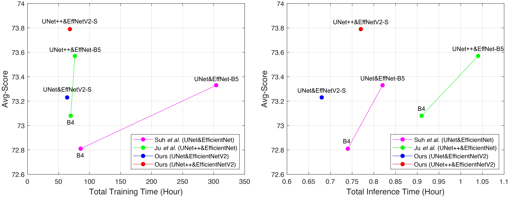
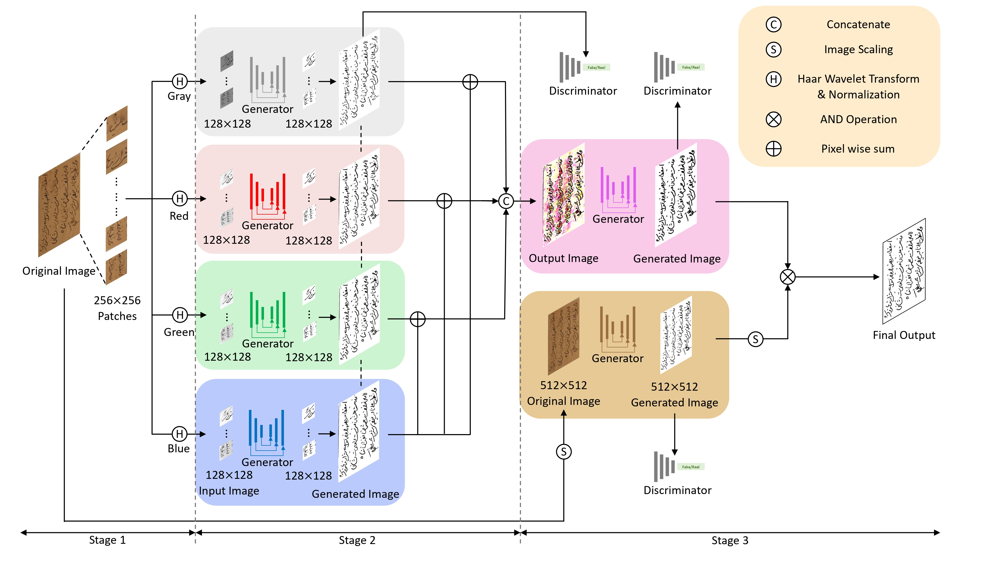
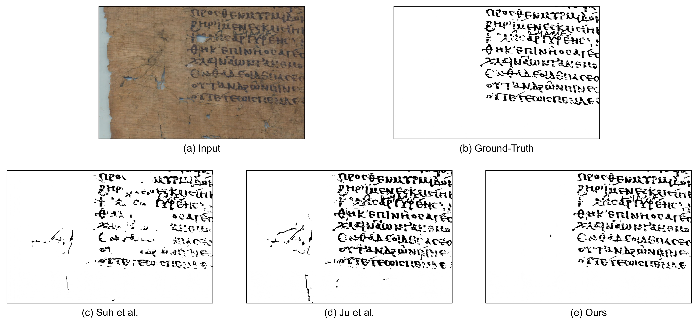

# MFE-GAN
MFE-GAN: Efficient GAN-based Framework for Document Image Enhancement and Binarization with Multi-scale Feature Extraction
> [arXiv](https://arxiv.org/abs/2407.04231)
> [Project](https://ruiyangju.github.io/MFE-GAN/)

<p align="center">
  
</p>

## Citation
If you find our paper useful in your research, please consider citing:
```
  @article{ju2024mfe,
    title={MFE-GAN: Efficient GAN-based Framework for Document Image Enhancement and Binarization with Multi-scale Feature Extraction},
    author={Ju, Rui-Yang and Wong, KokSheik and Chiang, Jen-Shiun},
    journal={arXiv preprint arXiv:2407.04231},
    year={2024}
  }
```
    
## Method
<p align="center">
  
</p>

## Datasets
* Our training set (143) includes:

  [DIBCO 2009](http://users.iit.demokritos.gr/~bgat/DIBCO2009/benchmark/) (10), [H-DIBCO 2010](http://users.iit.demokritos.gr/~bgat/H-DIBCO2010/benchmark/) (10), [H-DIBCO 2012](http://utopia.duth.gr/~ipratika/HDIBCO2012/benchmark/) (14), [Bickley Diary](https://github.com/vqnhat/DSN-Binarization/files/2793688/original_gt_labeled.zip) (7), [PHIBD](http://www.iapr-tc11.org/mediawiki/index.php/Persian_Heritage_Image_Binarization_Dataset_(PHIBD_2012)) (15), [SMADI](https://tc11.cvc.uab.es/datasets/SMADI_1) (87).
  
* Our test set (102) includes:

  [DIBCO 2011](http://utopia.duth.gr/~ipratika/DIBCO2011/benchmark/) (16), [DIBCO 2013](http://utopia.duth.gr/~ipratika/DIBCO2013/benchmark/) (16), [H-DIBCO 2014](http://users.iit.demokritos.gr/~bgat/HDIBCO2014/benchmark/) (10), [H-DIBCO 2016](http://vc.ee.duth.gr/h-dibco2016/benchmark/) (10), [DIBCO 2017](http://vc.ee.duth.gr/dibco2017/benchmark/) (20), [H-DIBCO 2018](https://vc.ee.duth.gr/h-dibco2018/benchmark/) (10), [DIBCO 2019](https://vc.ee.duth.gr/dibco2019/benchmark/) (20).

* Put training set into `./Trainset/`, and put test set into `./Testset/`.

## Result (DIBCO 2019-009)
<p align="center">
  
</p>

## Environment
* NVIDIA GPU + CUDA CuDNN
* Creat a new Conda environment:
  ```
    conda env create -f environment.yaml
  ```

## UNet & EfficientNetV2-S
### Train
```
  cd unet_effnetv2
  python image_to_256.py
  python image_to_512.py
  python train_stage2_unet.py --epochs 10 --lambda_loss 25 --base_model_name tu-efficientnetv2_rw_s --batch_size 64
  python predict_for_stage3_unet.py --base_model_name tu-efficientnetv2_rw_s --lambda_loss 25
  python train_stage3_unet.py --epochs 10 --lambda_loss 25 --base_model_name tu-efficientnetv2_rw_s --batch_size 64
  python train_stage3_unet_resize.py --epochs 150 --lambda_loss 25 --base_model_name tu-efficientnetv2_rw_s --batch_size 16
```
### Test
```
  python eval_stage3_all_unet.py --lambda_loss 25 --base_model_name tu-efficientnetv2_rw_s --batch_size 64
```

## UNet++ & EfficientNetV2-S
### Train
```
  cd unetplusplus_effnetv2
  python image_to_256.py
  python image_to_512.py
  python train_stage2.py --epochs 10 --lambda_loss 25 --base_model_name tu-efficientnetv2_rw_s --batch_size 64
  python predict_for_stage3.py --base_model_name tu-efficientnetv2_rw_s --lambda_loss 25
  python train_stage3.py --epochs 10 --lambda_loss 25 --base_model_name tu-efficientnetv2_rw_s --batch_size 64
  python train_stage3_resize.py --epochs 150 --lambda_loss 25 --base_model_name tu-efficientnetv2_rw_s --batch_size 16
```

### Test
```
  python eval_stage3_all.py --lambda_loss 25 --base_model_name tu-efficientnetv2_rw_s --batch_size 64
```
